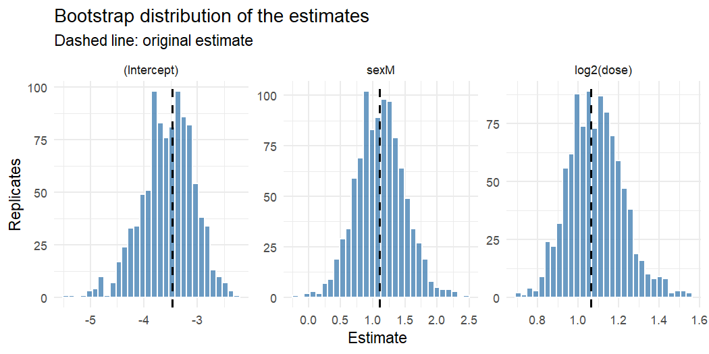
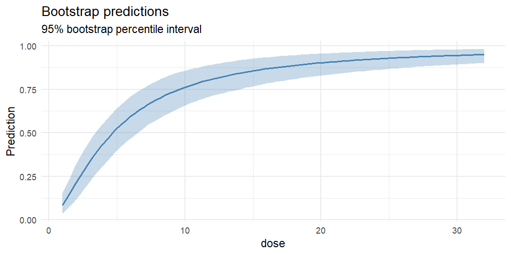

<!-- README.md is generated from README.Rmd. Please edit that file and run devtools::build_readme(). -->

# parametricboot

<!-- badges: start -->

[](https://github.com/DiogoRibeiro7/parametricboot/actions/workflows/R-CMD-check.yaml)
[](https://app.codecov.io/gh/DiogoRibeiro7/parametricboot)
[](https://lifecycle.r-lib.org/articles/stages.html#experimental)
[](LICENSE.md)
<!-- badges: end -->

parametricboot automates the **parametric bootstrap** for fitted
regression models. You fit a model as usual; the package simulates new
responses from it, refits the model to each of them, and turns the
replicates into bias estimates, standard errors, confidence intervals,
prediction intervals, likelihood-ratio tests and diagnostic plots.

Supported models:

| Model | Fitted with | How replicates are generated |
|----|----|----|
| Linear and generalised linear models | `lm()`, `glm()` | `simulate()`, then the original call is re-evaluated |
| Linear and generalised linear mixed models | `lme4::lmer()`, `lme4::glmer()` | `simulate()`, then `lme4::refit()` |
| Cox proportional hazards models | `survival::coxph()` | model-based resampling (Davison & Hinkley, 1997, Algorithm 7.3) |

## Installation

parametricboot is a work in progress: it is not on CRAN, and the
interface may still change. Install the development version from GitHub:

``` r
# install.packages("pak")
pak::pak("DiogoRibeiro7/parametricboot")
```

## Example

A classic dose-response experiment (Collett, 1991): batches of 20
tobacco budworm moths of each sex were exposed to six doses of a
pyrethroid, and the number killed was recorded. That is only 12 binomial
observations, so how far can the large-sample theory behind
`summary(fit)` be trusted?

``` r
library(parametricboot)

budworm <- data.frame(
  sex = rep(c("M", "F"), each = 6),
  dose = rep(c(1, 2, 4, 8, 16, 32), times = 2),
  dead = c(1, 4, 9, 13, 18, 20, 0, 2, 6, 10, 12, 16),
  n = 20
)
fit <- glm(cbind(dead, n - dead) ~ sex + log2(dose), data = budworm, family = binomial())

res <- pb_simulate(fit, n = 1000, seed = 2025)
res
#> <pb_boot> Parametric bootstrap
#>   Model:      glm (binomial)
#>   Replicates: 1000
#>   Terms:      (Intercept), sexM, log2(dose)
```

`pb_summary_table()` reports, for each coefficient, the bootstrap
estimates of bias, standard error and mean squared error, the actual
coverage of the nominal 95% Wald interval, and a bootstrap confidence
interval:

``` r
pb_summary_table(res)
#>          term  estimate boot_mean        bias std_error        mse coverage
#> 1 (Intercept) -3.473155 -3.552493 -0.07933778 0.4839494 0.24026729    0.954
#> 2        sexM  1.100743  1.117377  0.01663401 0.3784177 0.14333343    0.945
#> 3  log2(dose)  1.064214  1.088388  0.02417447 0.1352250 0.01885192    0.946
#>        lower     upper
#> 1 -4.5809602 -2.702189
#> 2  0.4015961  1.856280
#> 3  0.8444751  1.401441
```

Here the news is good: the slope is overestimated by about 2%, a small
fraction of its standard error, and the Wald intervals cover as
advertised. The bootstrap distributions are close to normal:

``` r
pb_plot_estimates(res)
```



The same replicates give intervals for any prediction, here the
dose-response curve for male moths:

``` r
males <- data.frame(sex = "M", dose = seq(1, 32, length.out = 100))
pb_plot_predictions(res, males, x = "dose", type = "response")
```



## Functions

| Task | Functions |
|----|----|
| Draw replicates | `pb_simulate()`, `pb_parallel()`, `pb_drop_warned()` |
| Summarise | `pb_summary_table()`, `pb_key_stats()`, `pb_confint()`, `pb_tidy()`, plus `print()`, `summary()` and `confint()` methods |
| Visualise | `pb_plot_estimates()`, `pb_plot_diagnostics()`, `pb_plot_predictions()` |
| Predict | `pb_predict_boot()` |
| Test nested models | `pb_lrt()`, `pb_plot_lrt()` |
| Compare other models | `pb_compare_models()` |
| Nonparametric helper | `pb_resample()` |

The [getting-started
article](https://diogoribeiro7.github.io/parametricboot/articles/parametricboot.html)
(`vignette("parametricboot")`) is a tour that also covers mixed models,
Cox models, bootstrap likelihood-ratio tests, and what to do when some
refits misbehave. The full [function
reference](https://diogoribeiro7.github.io/parametricboot/reference/) is
on the package website.

## Getting help and contributing

Please report bugs and request features on the [issue
tracker](https://github.com/DiogoRibeiro7/parametricboot/issues).
Contributions are welcome; see the [contributing
guide](.github/CONTRIBUTING.md). This project follows a [code of
conduct](CODE_OF_CONDUCT.md).

## Citation

    Ribeiro D (2026). _parametricboot: Parametric Bootstrap for Fitted
    Regression Models_. R package version 0.0.0.9000,
    <https://github.com/DiogoRibeiro7/parametricboot>.

## License

MIT © Diogo Ribeiro. See [LICENSE.md](LICENSE.md).
